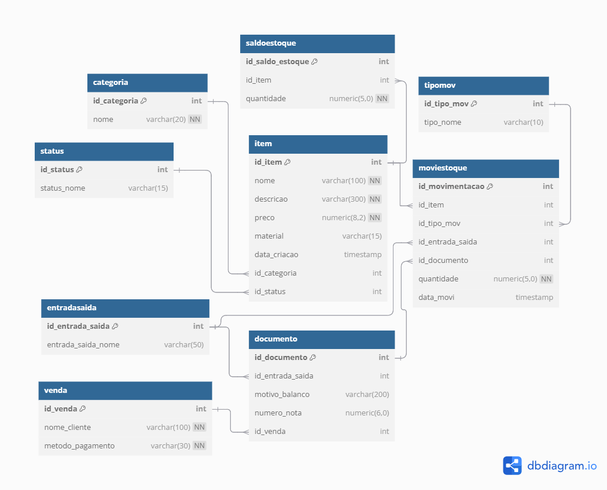

## Projeto Estoque de E-commerce - GRUPO A

---

## **Integrantes do Grupo**
- **Arthur Ghizi** - [@Arthu085](https://github.com/Arthu085)  
- **Cristoffer Figueiredo Martins** - [@cristoffer21](https://github.com/cristoffer21)  
- **Gabriel Jorge Lóh** - [@gabrieljloh](https://github.com/gabrieljloh)  
- **Gabriel Custódio Boelter** - [@GabrielBoelter](https://github.com/GabrielBoelter)  
- **Jean Lucas Preis** - [@JeanPrei](https://github.com/JeanPrei)  
- **João Vitor Figueiredo Espindola** - [@joaovfe](https://github.com/joaovfe)  

---

## **Modelo Físico do Banco de Dados**

O modelo físico foi desenvolvido utilizando a ferramenta [dbdiagram.io](https://dbdiagram.io/). Ele serviu como base para a exportação dos scripts DDL das tabelas e seus relacionamentos.  

- **Arquivo fonte**: [Modelo Físico](https://dbdiagram.io/d/673537f4e9daa85aca608249).  
- **Imagem do modelo**:  

  

---

## **Dicionário de Dados**

O dicionário de dados contém informações detalhadas sobre as tabelas e índices utilizados no projeto.  
- **Arquivo do dicionário de dados**: [/dicionario_dados final.xlsx)](dicionario_dados/dicionario_dados final.xlsx).

---

## **Scripts SQL**

O projeto utiliza o banco de dados [PostgreSQL](https://www.postgresql.org/download/), uma plataforma open source. Os scripts estão organizados por categoria:  

- **DDL (Definição de Tabelas e Relacionamentos)**: [ddl.sql](scripts_sql/ddl.sql)  
- **Índices**: [indices.sql](scripts_sql/indices.sql)  
- **DML (Manipulação de Dados)**: [dml.sql](scripts_sql/dml.sql)  
- **Triggers**: [triggers.sql](scripts_sql/triggers.sql)  
- **Stored Procedures**: [stored_procedures.sql](scripts_sql/stored_procedures.sql)  
- **Functions**: [functions.sql](scripts_sql/functions.sql)  

---

## **Código-Fonte do Sistema**

O sistema foi desenvolvido como um **projeto monolítico** utilizando as seguintes tecnologias:  
- **Linguagem de programação**: PHP  
- **Framework**: Laravel  
- **Banco de Dados**: PostgreSQL hospedado no **Supabase**, garantindo acesso centralizado ao banco de dados para todos os usuários, sem a necessidade de criar o banco localmente a cada acesso.  

A escolha pelo Laravel possibilitou a implementação ágil de um sistema CRUD robusto e escalável, aproveitando suas ferramentas integradas, como Eloquent ORM, para interagir com o banco de dados de forma eficiente.

O código-fonte do projeto pode ser acessado aqui: [Código Fonte CRUD](https://github.com/joaovfe/Estoque) [Código Fonte scripts](https://github.com/gabrieljloh/StoreStocker).  
---

## **Relatório Final**

O relatório final, com detalhes sobre o desenvolvimento do projeto, está disponível no arquivo:  
- [template1.docx](relatorio/template1.docx)  

---
